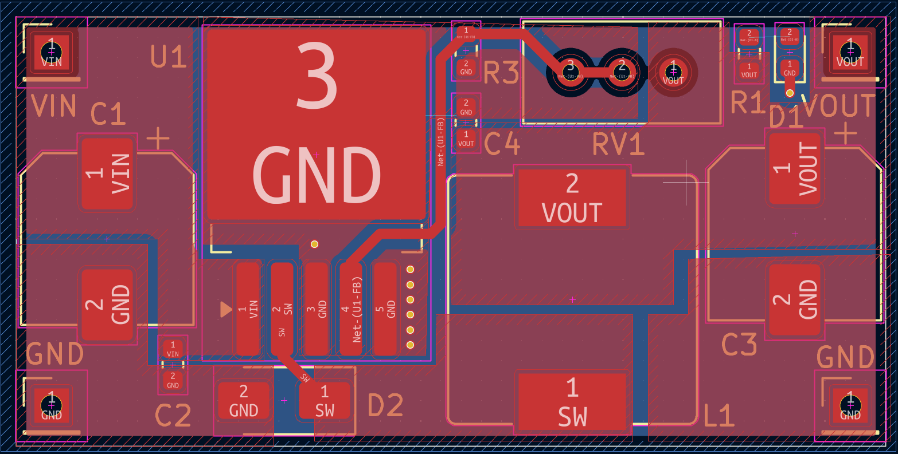
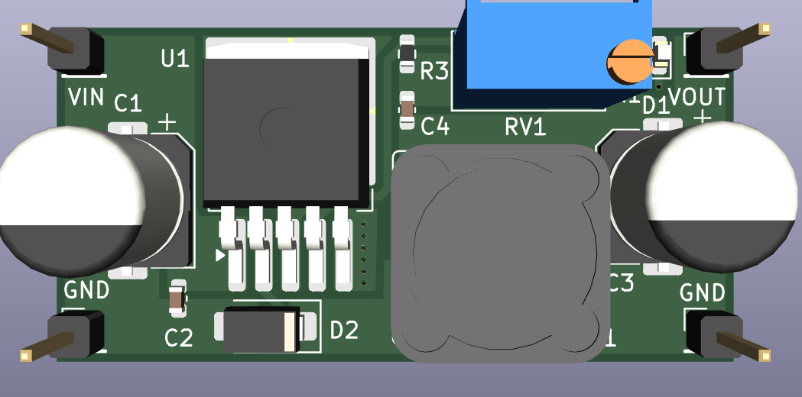
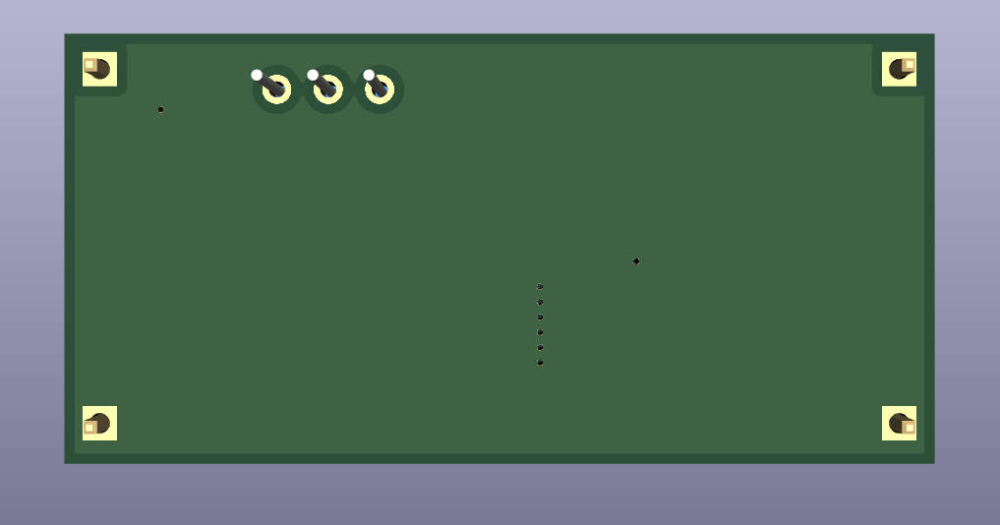
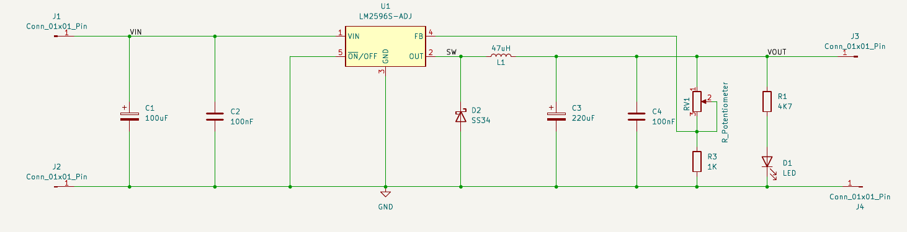

# LM2596S-Buck-Converter
Custom LM2596S Buck Converter

## Hardware Visuals

### PCB Layout


### 3D Renders
| Front Render | Back Render |
| :---: | :---: |
|  |  |

### Schematic


---

## Repository Structure

```text
├── Images/
│   ├── pcb_layout.png
│   ├── 3d_render_front.png
│   ├── 3d_render_back.png
│   └── schematic.png
└── README.md
